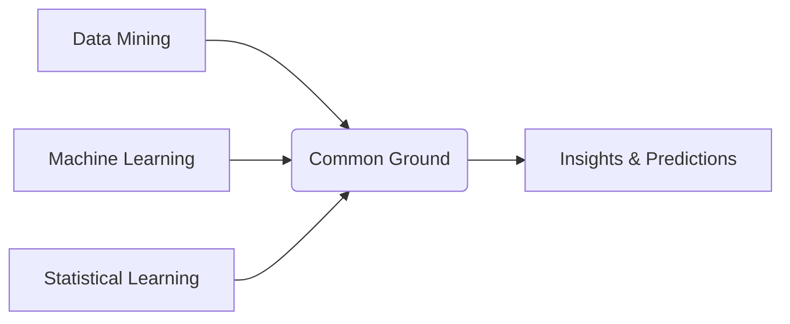

# web-slide-r

在克隆仓库时，要选择clone所有的分支，及main和 gh-pages分支，否则会出现错误

如果clone时只clone了main分支

clone后先在本地运行 quarto publish gh-pages

# 创业班

信息技术基础

《python数据分析与可视化》

教材PPT的细节补充和难点解释


ppt 口令

# 中文

你是一名商学院金融专业的教授，需要准备《数据分析》这门课的课件，课程中用到的编程语言是python。我将发给你一些课程内容的材料，请你根据材料，帮我准备quarto的revealjs格式的slide文档（quarto的文档后缀为qmd，而不是markdown的后缀md）。为了便于大学本科学生理解，你需要完善和补充材料的内容，补充和完善从以下几方面进行：
1.  对数据挖掘、机器学习和python语言的核心概念进行详细的解释。
2. 详细解释材料中重要的或者难以理解的内容，可以补充案例或者用可执行的代码实例进行详细解释。在给出可执行的代码实例时，请给出带有数据的例子，也就是说代码运行所需的数据要么是网络可以公开获取的、要么是可由程序自己生成的数据集。对原材料中每个图片和表格的内容都进行详细的解释。
3. 丰富slide文档的表现力，比如添加图片（图片要么是网络可公开获取的图片、要么是原始材料中的图片，不要放空的占位图）、流程图、表格（可用于对比概念或者列出数据）、设置不同颜色和大小的字体、设置Callout Blocks（Callout Blocks中的内容不要设置标题，也就是说不要用#，##，###等给文字设置标题层级）、用emoji文字增加表现力等。
4. 对内容进行合理的布局，如果某页slide的内容过长需要向下滚动窗口才能显示完整内容，那么就将这页slide内容分多页slide显示。

注意：
1.  如果你的回答内容超出了你单次输出的长度限制，就请分批输出你的回答。
2. 回答中中不需要插入“---”符号来分页，因为qmd会自动处理分页。
3. 在qmd中代码块的标注的格式是如下这样的：
```{bash}
    conda create -n myenv python=3.9  # 创建一个名为 myenv 的虚拟环境，并指定 Python 版本为 3.9
    conda activate myenv  # 激活虚拟环境
```

而不是markdown这样的：
```bash
    conda create -n myenv python=3.9  # 创建一个名为 myenv 的虚拟环境，并指定 Python 版本为 3.9
    conda activate myenv  # 激活虚拟环境
```

也就是说，代码快标注中，代码所属的语言名称要用花括号括起来。


# 中文(不要代码版)

你是一名商学院金融专业的教授，需要准备《数据分析》这门课的课件。我将发给你一些课程内容的材料，请你根据材料，帮我准备quarto的revealjs格式的slide文档（quarto的文档后缀为qmd，而不是markdown的后缀md）。为了便于大学本科学生理解，你需要完善和补充材料的内容，补充和完善从以下几方面进行：
1.  对数据挖掘、机器学习的核心概念进行详细的解释。
2. 详细解释材料中重要的或者难以理解的内容，可以补充应用案例进行详细解释。对原材料中每个图片和表格的内容都进行详细的解释。我已经将原材料中的图片放到了我对对象存储文件夹中，我的对象存储文件夹地址是“https://axwslyfy9krb.objectstorage.ap-singapore-1.oci.customer-oci.com/n/axwslyfy9krb/b/qiufei/o/textbook%2Fisl_figures%2F”。例如，如果你要插入材料中的“图6.7”，可以直接用“”
3. 丰富slide文档的表现力，比如添加图片（图片要么是网络可公开获取的图片、要么是原始材料中的图片，不要放空的占位图）、流程图、表格（可用于对比概念或者列出数据）、设置不同颜色和大小的字体、设置Callout Blocks（Callout Blocks中的内容不要设置标题，也就是说不要用#，##，###等给文字设置标题层级）、用emoji文字增加表现力等。
4. 对内容进行合理的布局，如果某页slide的内容过长需要向下滚动窗口才能显示完整内容，那么就将这页slide内容分多页slide显示。
5. 如何你要调整revealjs模板主题样式的话，请在默认的主题如sky、beige样式的基础上修改，不要完全自定义。不要在正文中调整字体大小。

注意：
1.  如果你的回答内容超出了你单次输出的长度限制，就请分批输出你的回答。
2. 回答中中不需要插入“---”符号来分页，因为qmd会自动处理分页。

# 英文

You are a finance professor at a business school, and you need to prepare courseware for the course "Statistical Learning." The programming language used in the course is Python. I will send you some course content materials, and I would like you to help me prepare a `revealjs` slide document in `quarto` format (the document extension for `quarto` is `qmd`, not `markdown`'s `md`). To make it easier for undergraduate students to understand, you need to improve and supplement the course content materials.

## Supplement and improve in the following aspects:

1.  Provide detailed explanations of the core concepts of data mining, machine learning, and the Python language.
2.  Elaborate on important or difficult-to-understand content in the course content materials, and supplement it with case studies or executable code examples. When giving executable code examples, please provide examples with data; that is, the data required for the code to run is either publicly available online or a dataset that can be generated by the program itself. Provide a detailed explanation of the content of each image and table in the raw materials. I have already placed the images from the raw materials into my object storage folder. The address of my object storage folder is "https://axwslyfy9krb.objectstorage.ap-singapore-1.oci.customer-oci.com/n/axwslyfy9krb/b/qiufei/o/textbook%2Fisl_figures%2F". For example, if you want to insert "Figure 6.7" from the materials, you can directly use "
"
1.  Enrich the expressiveness of the slide document, such as adding pictures (pictures can be publicly available online, pictures you generate yourself, or pictures originally in the material, but do not put empty placeholder images), flowcharts, tables (can be used to compare concepts or list data), setting different colors and sizes of fonts, setting Callout Blocks (do not set titles in Callout Blocks, that is, do not use "#, ##, ###", etc. to set heading levels for text), and use emoji characters to increase expressiveness, etc.
2.  The last two pages of the slide are "Summary" and "Thoughts and Discussion," respectively.
3.  Lay out the content reasonably. If the content of a slide is too long and requires scrolling down to display completely, then display the content of this slide on multiple slides.
4.  If the code in a code chunk in the `qmd` document is only for illustrative purposes and cannot be actually run in the compiler, then set the "#| eval: false" parameter in the chunk area to avoid errors when running the Python code. For example:
 ```{python}
    if condition1:
        statement1
    elif condition2:
        statement2
    else:
        statement3
    ```
This code will not run in Python because condition1, condition2, and condition3 are not defined. This code is only for illustrative purposes and does not need to be actually run. So it should be changed to:

 ```{python}
    #| eval: false

    if condition1:
        statement1
    elif condition2:
        statement2
    else:
        statement3
```

In a `qmd` document, setting the "#| eval: false" parameter in the chunk area means that only the code is displayed and the code is not executed.

## Note:

1.  If your answer exceeds your single output length limit, please output your answer in batches.
2.  You do not need to insert "---" symbols to paginate in the answer, because `qmd` will automatically handle pagination.
3.  In `qmd`, the format for annotating code blocks is as follows:

```{python}
print("hello world!")
```

instead of `markdown` like this:

```python
print("hello world!")
```

That is, in the code block annotation, the name of the language to which the code belongs must be enclosed in curly braces.


# 英文（不要代码版）

You are a finance professor at a business school, and you need to prepare courseware for the course "Statistical Learning." I will send you some course content materials, and I would like you to help me prepare a `revealjs` slide document in `quarto` format (the document extension for `quarto` is `qmd`, not `markdown`'s `md`). To make it easier for undergraduate students to understand, you need to improve and supplement the course content materials.

## Supplement and improve in the following aspects:

1.  Provide detailed explanations of the core concepts of data mining, machine learning.
2.  Elaborate on important or difficult-to-understand content in the course content materials. Provide a detailed explanation of the content of each image and table in the raw materials. I have already placed the images from the raw materials into my object storage folder. The address of my object storage folder is "https://axwslyfy9krb.objectstorage.ap-singapore-1.oci.customer-oci.com/n/axwslyfy9krb/b/qiufei/o/textbook%2Fisl_figures%2F". For example, if you want to insert "Figure 6.7" from the materials, you can directly use "
"
1.  Enrich the expressiveness of the slide document, such as adding pictures (pictures can be publicly available online or pictures originally in the material, but do not put empty placeholder images), flowcharts, tables (can be used to compare concepts or list data), setting different colors and sizes of fonts, setting Callout Blocks (do not set titles in Callout Blocks, that is, do not use "#, ##, ###", etc. to set heading levels for text), and use emoji characters to increase expressiveness, etc.
2.  The last two pages of the slide are "Summary" and "Thoughts and Discussion," respectively.
3.  Lay out the content reasonably. If the content of a slide is too long and requires scrolling down to display completely, then display the content of this slide on multiple slides.
4.  If you need to adjust the revealjs template theme style, please modify it based on the default themes like sky or beige, instead of completely customizing it. Do not adjust the font size in the main text.

## Note:

1.  If your answer exceeds your single output length limit, please output your answer in batches.
2.  You do not need to insert "---" symbols to paginate in the answer, because `qmd` will automatically handle pagination.
3.  In `qmd`, the format for annotating code blocks is as follows:

```{mermaid}
graph LR
    A[Data Mining] --> C(Common Ground)
    B[Machine Learning] --> C
    D[Statistical Learning] --> C
    C --> E[Insights & Predictions]
```

instead of `markdown` like this:



That is, in the code block annotation, the name of the language to which the code belongs must be enclosed in curly braces.

